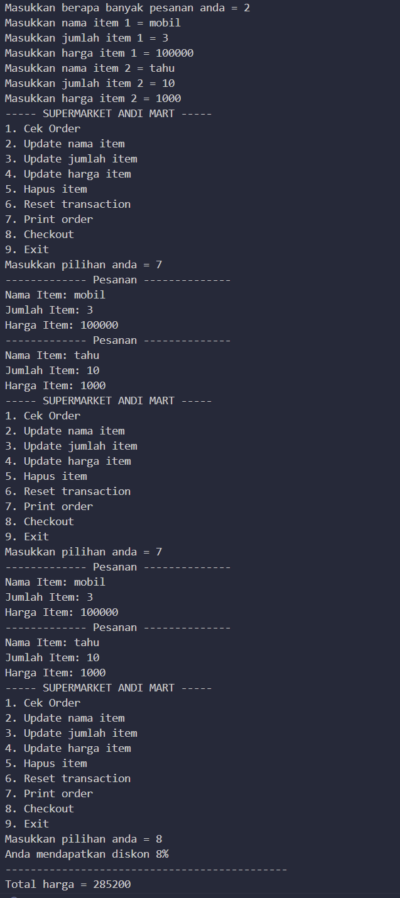
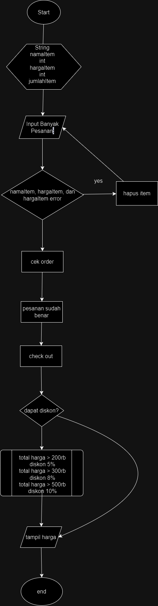

# LAPORAN  

<h1> OUTPUT </h1>

## PENJELASAN 

update_item_name mengganti nama item ke nama item baru
update_quantity menambahkan quantity pada stok yang ada di database
update_price menaikkan harga jual untuk satuan item tersebut
delete_item akan menghapus data dari tabel items berdasarkan idnya
reset_transaction untuk mereset  seluruh transaksu/ pesanan
cek_order untuk mengecek seluruh orderan yang di input

## FlowChart

