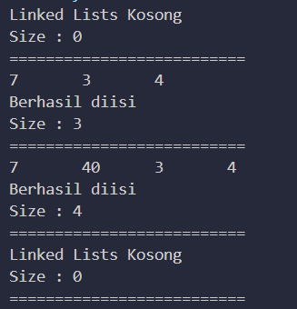
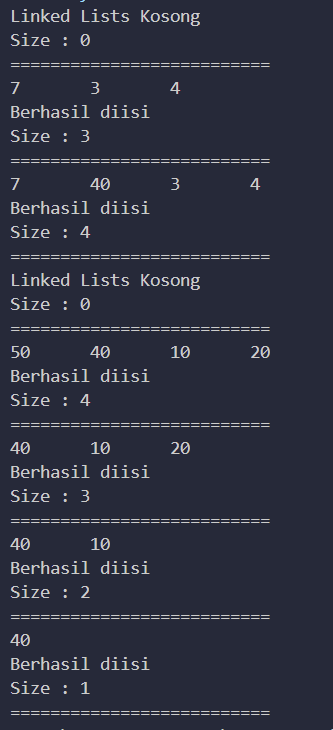
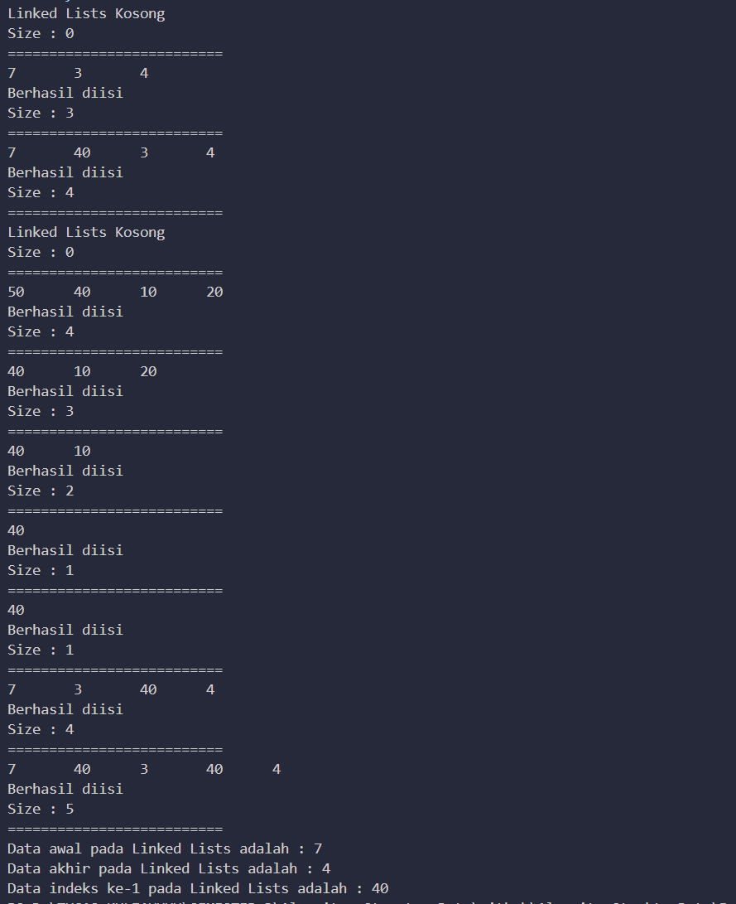

# LAPORAN

## PRATIKUM 1

 PERTANYAAN  1

 1. Single linked list hanya memiliki satu variabel pointer yang menunjuk ke node selanjutnya, sedangkan doubly linked list memiliki dua variabel pointer yang menunjuk ke node selanjutnya dan sebelumnya

 2. Atribut next dan prev pada class Node digunakan untuk menunjuk ke node selanjutnya dan sebelumnya dalam linked list. Atribut next menunjuk pada node selanjutnya, sedangkan atribut prev menunjuk pada node sebelumnya
 
 3. Konstruktor pada class DoublyLinkedList digunakan untuk menginisialisasi atribut head dan size. Atribut head menunjuk ke node pertama dalam linked list, sedangkan atribut size menyimpan jumlah node dalam linked list

 4. Pada method addFirst(), atribut prev dianggap sama dengan null karena node yang ditambahkan pada awal linked list tidak memiliki node sebelumnya. Oleh karena itu, atribut prev diisi dengan nilai null untuk menandakan bahwa node tersebut adalah node pertama pada linked list. Atribut next diisi dengan nilai null karena node tersebut belum memiliki node selanjutnya pada saat ditambahkan ke linked list

 5. Pada method addFirst(), head.prev = newNode berarti bahwa prev dari node yang sebelumnya menunjuk ke head akan diatur ke newNode. Dengan kata lain, newNode akan menjadi node pertama dalam linked list.

 6. Pada method addLast(), pembuatan objek Node dengan mengisikan parameter prev dengan current, dan next dengan null berarti bahwa node baru yang dibuat akan diletakkan di akhir linked list, sehingga node sebelumnya adalah node yang saat ini berada di akhir linked list, dan node selanjutnya belum ada (atau null).

 7. Pada method add(), potongan kode program tersebut digunakan untuk menambahkan node baru ke dalam linked list. Jika current.prev bernilai null, artinya current adalah node pertama dalam linked list. Oleh karena itu, node baru yang ditambahkan akan diletakkan di awal linked list, dan atribut prev dari current akan diatur ke node baru. Selain itu, atribut head juga akan diatur ke node baru karena node baru adalah node pertama dalam linked list

## PRATIKUM 2
 

 PERTANYAAN
 
 1.Pada method removeFirst(), statement head = head.next berarti bahwa node pertama dalam linked list akan dihapus dan node selanjutnya akan menjadi node pertama. Statement head.prev = null berarti bahwa atribut prev dari node pertama sebelumnya (yang sekarang telah dihapus) akan diatur ke null karena tidak ada node sebelumnya 

 2. Untuk mendeteksi posisi data pada bagian akhir dalam method removeLast(), kita dapat menggunakan loop untuk menelusuri linked list sampai ke node terakhir. Setelah mencapai node terakhir, kita dapat menghapus node tersebut dengan mengatur atribut next dari node sebelumnya ke null

 3. Potongan kode program di bawah ini tidak cocok untuk perintah remove karena jika node yang dihapus adalah node terakhir dalam linked list, maka statement tmp.next.prev = head akan mengakibatkan error karena tmp.next bernilai null. Selain itu, jika linked list hanya memiliki satu node, maka statement head.next = tmp.next akan mengakibatkan error karena tmp.next bernilai null
 Node tmp = head.next;
head.next = tmp.next;
tmp.next.prev = head;

4. Kode program berikut ini pada fungsi remove digunakan untuk menghapus node yang ditunjuk oleh variabel current. Statement current.prev.next = current.next berarti bahwa atribut next dari node sebelumnya akan diatur ke node setelahnya, sehingga node yang ditunjuk oleh variabel current tidak lagi terhubung dengan linked list. Statement current.next.prev = current.prev berarti bahwa atribut prev dari node setelahnya akan diatur ke node sebelumnya, sehingga linked list tetap terhubung setelah node yang ditunjuk oleh variabel current dihapus

## PRATIKUM 3

PERTANYAAN

1. Method size() pada class DoublyLinkedList digunakan untuk mengembalikan jumlah node dalam linked list 

2. Untuk mengatur indeks pada doubly linked lists supaya dapat dimulai dari indeks ke-1, kita dapat menambahkan sebuah node dummy di awal linked list yang tidak memiliki nilai data dan hanya berfungsi sebagai penunjuk awal linked list. Dengan demikian, node pertama dalam linked list akan memiliki indeks 1 

3. Untuk mengatur indeks pada doubly linked lists supaya dapat dimulai dari indeks ke-1, kita dapat menambahkan sebuah node dummy di awal linked list yang tidak memiliki nilai data dan hanya berfungsi sebagai penunjuk awal linked list. Dengan demikian, node pertama dalam linked list akan memiliki indeks 1 

4. Kode program pertama dan kedua sama-sama digunakan untuk mengecek apakah sebuah linked list kosong atau tidak. Perbedaan logika antara kedua kode program tersebut adalah pada kode program pertama, kita memeriksa apakah nilai dari variabel size sama dengan 0 untuk menentukan apakah linked list kosong atau tidak, sedangkan pada kode program kedua, kita memeriksa apakah variabel head bernilai null untuk menentukan apakah linked list kosong atau tidak