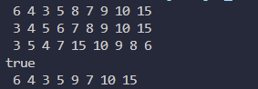

# LAPORAN PERTEMUAN 10

## PRATIKUM 1

### PERTANYAAN
1. Mengapa dalam binary search tree proses pencarian data bisa lebih efektif dilakukan dibanding binary tree biasa?
2. Apa fungsi atribut left dan right pada class Node?
3. Simak pertanyaan berikut,
(A). Apa kegunaan dari atribut root di dalam class BinaryTree?
(B). Ketika objek tree pertama kali dibuat, apa nilai dari root?
4. Ketika tree masih kosong, dan akan ditambahkan sebuah node baru, proses apa yang akan terjadi?
5. Perhatikan method add(), di dalamnya terdapat baris program seperti di bawah ini. Jelaskan secara detil untuk apa baris program tersebut?
if(data < current.data) {
    if(current.left != null) {
        current = current.left;
    } else {
        current.left = new Node(data);
        break;
    }
}

### JAWAB
1. Binary Search Tree (BST) adalah bentuk khusus dari Binary Tree yang memiliki sifat tertentu. Pada BST, setiap node memiliki nilai yang lebih besar dari semua node di sub-pohon kiri dan lebih kecil dari semua node di sub-pohon kanan.
2. Atribut left dan right pada class Node digunakan untuk menunjukkan node anak kiri dan kanan dari suatu node. Dalam implementasi BST, atribut left menunjukkan node anak kiri yang memiliki nilai lebih kecil dari node induk, sedangkan atribut right menunjukkan node anak kanan yang memiliki nilai lebih besar dari node induk
3. (A). Atribut root pada class BinaryTree digunakan untuk menunjukkan node paling atas dari pohon biner
   (B). Ketika objek tree pertama kali dibuat, nilai dari root adalah null karena pohon biner masih kosong
4. Ketika tree masih kosong dan akan ditambahkan sebuah node baru, node baru tersebut akan menjadi root dari pohon biner
5. Baris program if(data < current.data) pada method add() digunakan untuk membandingkan nilai data dengan nilai data dari current. Jika nilai data lebih kecil dari nilai data dari current, maka program akan mengecek apakah current.left tidak null. Jika current.left tidak null, maka current akan diubah menjadi current.left. Jika current.left adalah null, maka node baru dengan nilai data akan dibuat dan diatur sebagai node anak kiri dari current

## PRATIKUM 2

### PERTANYAAN 
1. Apakah kegunaan dari atribut data dan idxLast yang ada di class BinaryTreeArray?
2. Apakah kegunaan dari method populateData()?
3. Apakah kegunaan dari method traverseInOrder()?
4. Jika suatu node binary tree disimpan dalam array indeks 2, maka di indeks berapakah posisi left child dan rigth child masin-masing?
5. Apa kegunaan statement int idxLast = 6 pada praktikum 2 percobaan nomor 4?

### JAWAB
1. Atribut data dan idxLast pada class BinaryTreeArray memiliki fungsi sebagai berikut:
   data: digunakan untuk menyimpan data (array) yang akan digunakan.
   idxLast: digunakan untuk menyimpan index terakhir pada array.
2. Method populateData() digunakan untuk mengisikan data array dan juga index terakhir dari array.
3. Method traverseInOrder() digunakan untuk melakukan penelusuran pada binary tree dengan urutan in-order.
4. Jika suatu node binary tree disimpan dalam array indeks 2, maka left child dan right child masing-masing berada di indeks 5 dan 6.
5. Pada praktikum 2 percobaan nomor 4, statement int idxLast = 6 digunakan untuk menginisialisasi variabel idxLast dengan nilai 6.