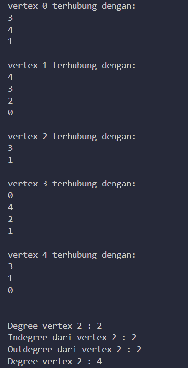
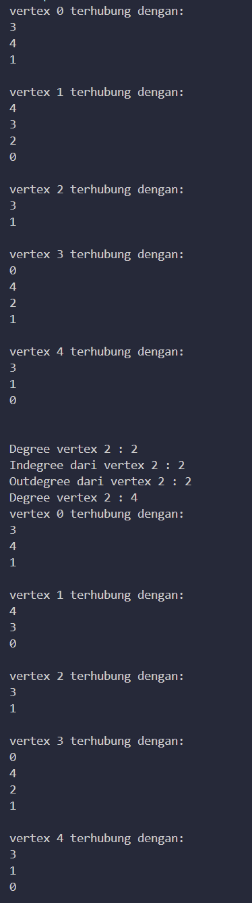

# PERTEMUAN 12

## Pratikum 1

## Pertanyaan
1.	Sebutkan beberapa jenis (minimal 3) algoritma yang menggunakan dasar Graph, dan apakah kegunaan algoritma-algoritma tersebut? 
2.	Pada class Graph terdapat array bertipe LinkedList, yaitu LinkedList list[]. Apakah tujuan pembuatan variabel tersebut ?  
3.	Apakah alasan pemanggilan method addFirst() untuk menambahkan data, bukan method add jenis lain pada linked list ketika digunakan pada method addEdge pada class Graph? 
4.	Bagaimana cara mendeteksi prev pointer pada saat akan melakukan penghapusan suatu edge pada graph ? 
5. 
Jawab 

1. 
(A) Breadth-First Search (BFS): Algoritma ini digunakan untuk mencari jalur terpendek dari suatu node ke node lain pada graph. Algoritma ini bekerja dengan cara menelusuri semua node yang berada pada level yang sama terlebih dahulu sebelum melanjutkan ke level berikutnya.
(B) Depth-First Search (DFS): Algoritma ini digunakan untuk mencari jalur pada graph dengan cara menelusuri node secara vertikal terlebih dahulu sebelum melanjutkan ke node yang berada pada level yang sama
(C) Dijkstra’s Algorithm: Algoritma ini digunakan untuk mencari jalur terpendek dari suatu node ke node lain pada graph yang memiliki bobot pada setiap edge-nya. Algoritma ini bekerja dengan cara memilih node dengan jarak terpendek dari node awal dan menelusuri semua node yang terhubung dengan node tersebut 

2. Variabel LinkedList list[] pada class Graph digunakan untuk menyimpan daftar node yang terhubung dengan node lain pada graph. Setiap elemen pada array list[] merepresentasikan node pada graph, dan setiap elemen tersebut berisi daftar node yang terhubung dengan node tersebut

3. Method addFirst() dipanggil pada method addEdge() pada class Graph karena method ini memungkinkan kita untuk menambahkan node baru pada awal linked list. Hal ini memungkinkan kita untuk menambahkan node baru dengan waktu yang lebih cepat dibandingkan dengan method add() yang menambahkan node baru pada akhir linked list

4. Prev pointer pada saat akan melakukan penghapusan suatu edge pada graph dapat dideteksi dengan cara menelusuri semua node pada graph dan mencari node yang terhubung dengan node yang akan dihapus. Setelah itu, kita dapat menghapus edge tersebut dan mengubah prev pointer pada node yang terhubung dengan node yang dihapus