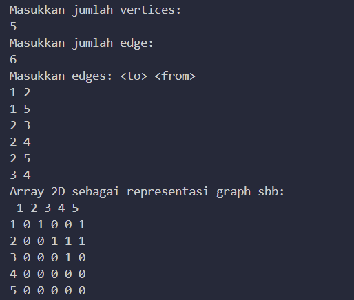

Pertanyaan 
1.	Apakah perbedaan degree/derajat pada directed dan undirected graph? 
2.	Pada implementasi graph menggunakan adjacency matriks. Kenapa jumlah vertices harus ditambahkan dengan 1 pada indeks array berikut? 
3. Apakah kegunaan method getEdge?
4.	Termasuk jenis graph apakah uji coba pada praktikum 12.3 ? 
5.	Mengapa pada method main harus menggunakan try-catch Exception ? 

jawaban

1. Degree pada graph adalah jumlah edge yang terhubung dengan suatu node. Pada undirected graph, degree dari suatu node adalah jumlah edge yang terhubung dengan node tersebut. Sedangkan pada directed graph, degree dari suatu node adalah jumlah edge yang keluar dari node tersebut

2. Pada implementasi graph menggunakan adjacency matrix, jumlah vertices harus ditambahkan dengan 1 pada indeks array karena array pada Java dimulai dari indeks 0. Dengan menambahkan 1 pada jumlah vertices, kita dapat memastikan bahwa array yang dibuat memiliki indeks yang dimulai dari 0 hingga jumlah vertices yang diinginkan

3.  Method getEdge() pada class Graph digunakan untuk mendapatkan edge yang terhubung dengan dua node tertentu pada graph. Method ini mengembalikan objek edge yang terhubung dengan dua node yang diberikan sebagai parameter. Jika tidak ada edge yang terhubung dengan dua node tersebut, maka method ini akan mengembalikan nilai null

4. undirected graph

5. Pada method main harus menggunakan try-catch Exception karena method tersebut memanggil method yang dapat menimbulkan exception. Dengan menggunakan try-catch Exception, kita dapat menangani exception yang mungkin terjadi pada method tersebut dan menghindari program dari crash
