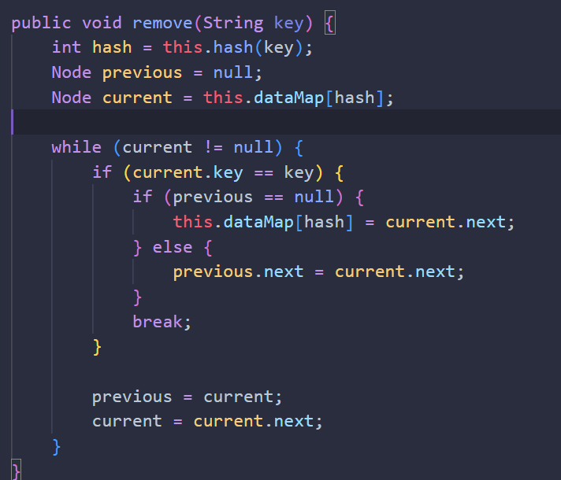

# LAPORAN

## PRATIKUM 1

after set

after get

after array

## pertanyaan
jawab

1. Metode separate chaining memiliki beberapa keunggulan dibandingkan dengan metode linear probing:
Implementasi yang lebih mudah dan sederhana.
Tabel hash tidak pernah penuh, sehingga selalu dapat menambahkan lebih banyak elemen ke dalam rantai.
Kurang sensitif terhadap fungsi hash atau faktor beban.

2. Potongan kode tersebut merupakan implementasi dari fungsi hash yang digunakan untuk menghasilkan nilai hash dari kunci yang diberikan. Fungsi hash ini mengambil masukan berupa string key dan mengembalikan nilai hash yang dihitung menggunakan rumus (hash + key.charAt(i) * i) % this.dataMap.length, di mana hash adalah nilai hash awal yang diinisialisasi dengan 0, key.charAt(i) adalah karakter ke-i dari string key, dan this.dataMap.length adalah panjang tabel hash 

3. Potongan kode tersebut merupakan implementasi dari metode set() yang digunakan untuk menambahkan data ke dalam tabel hash. Potongan kode tersebut melakukan hal berikut:

Pertama, mencari node yang sesuai dengan kunci yang diberikan di dalam tabel hash.
Jika node yang sesuai ditemukan, nilai value dari node tersebut ditambahkan dengan nilai value yang diberikan.
Jika tidak ditemukan, node baru dibuat dan ditambahkan ke dalam tabel hash 

4.  