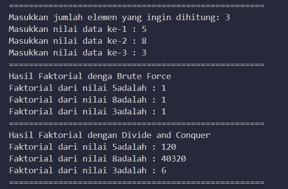
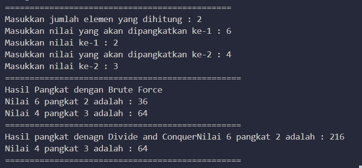
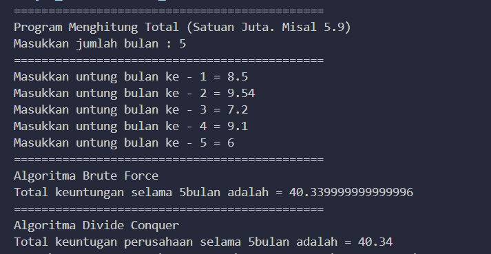
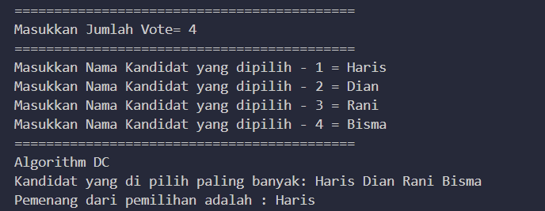

# PERTEMUAN 3
## Taufiq Satriaji APR
## SIB 2C
## 2241760142

<h1> OUTPUT </h1>

# pertanyaan 
1. Jelaskan mengenai base line Algoritma Divide Conquer untuk melakukan pencarian nilai faktorial! 
Algoritma Divide and Conquer adalah paradigma pemecahan masalah yang sering digunakan dalam pemrograman komputer, dan ini dapat diterapkan untuk mencari nilai faktorial juga. Faktorial dari suatu bilangan n, dilambangkan dengan n!, adalah hasil perkalian semua bilangan bulat positif dari 1 hingga n.

2. Pada implementasi Algoritma Divide and Conquer Faktorial apakah lengkap terdiri dari 3 tahapan 
Algoritma Divide and Conquer adalah salah satu pendekatan yang digunakan dalam pemrograman komputer untuk memecahkan masalah kompleks dengan membaginya menjadi submasalah yang lebih kecil, menyelesaikan submasalah tersebut, dan kemudian menggabungkan solusi submasalah tersebut menjadi solusi untuk masalah asal. Namun, tidak semua algoritma Divide and Conquer memiliki tiga tahap yang sama

3.	Apakah memungkinkan perulangan pada method faktorialBF() dirubah selain menggunakan for?Buktikan! 

<h1> OUTPUT </h1>

<h1> OUTPUT </h1>

<h1> OUTPUT TUGAS PRATIKUM </h1>

