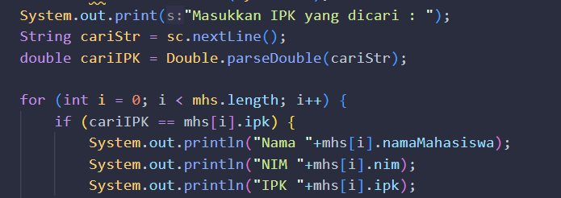

# LAPORAN
## PRATIKUM 4

1.

### PERTANYAAN
1. kode program ini digunakan untuk memeriksa apakah string yang ada dalam cari (kemungkinan berisi nama seorang mahasiswa) sama dengan nama mahasiswa yang ada dalam array mhs pada indeks ke-i. Jika benar, maka kondisi ini akan dievaluasi sebagai true, dan kode di dalam blok if akan dieksekusi. 

2.

3. 

## PRATIKUM ORDERED SEARCH
2.

### PERTANYAAN
1.Kode program yang diberikan menginisialisasi objek dari kelas OrderedSearch dengan parameter data. Untuk menjelaskan lebih detail, kita perlu melihat definisi dari kelas OrderedSearch serta bagaimana parameter data digunakan di dalamnya.

2. Pertama break: Pernyataan break biasanya digunakan untuk menghentikan eksekusi loop atau struktur kontrol saat kondisi tertentu terpenuhi.
Kedua break: Kembali, tanpa melihat kode lengkapnya, sulit untuk memberikan penjelasan yang lebih tepat.

3.

 
