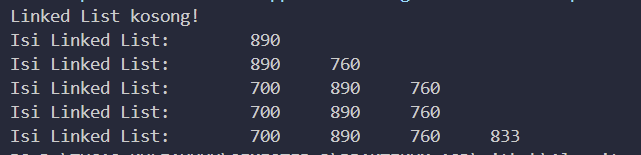
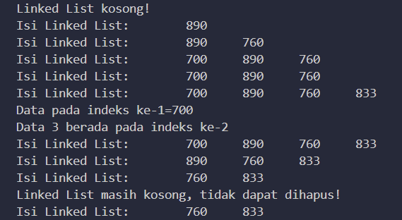
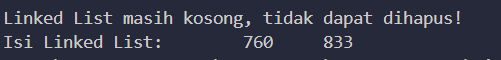
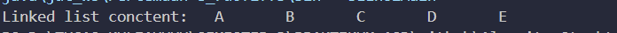

# LAPORAN
# -----------------------

## Pertanyaan
1.	Mengapa digunakan keyword break pada fungsi remove? Jelaskan! 
Keyword break digunakan dalam fungsi remove untuk menghentikan iterasi melalui linked list begitu saja setelah operasi penghapusan dilakukan.

2.	temp.next != null: Memastikan bahwa kita tidak mencoba mengakses temp.next jika temp adalah node terakhir dalam linked list.

temp.next.data == key: Memeriksa apakah node berikutnya (temp.next) memiliki nilai yang sama dengan key, yang merupakan nilai yang ingin dihapus.

# TUGAS 

