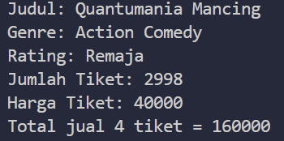
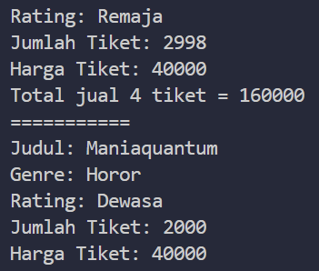
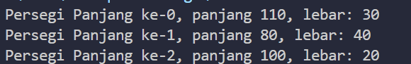
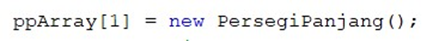
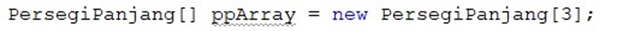
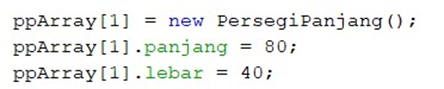
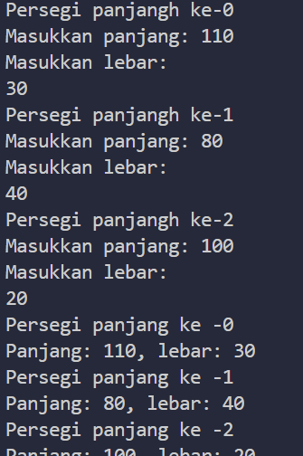
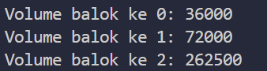
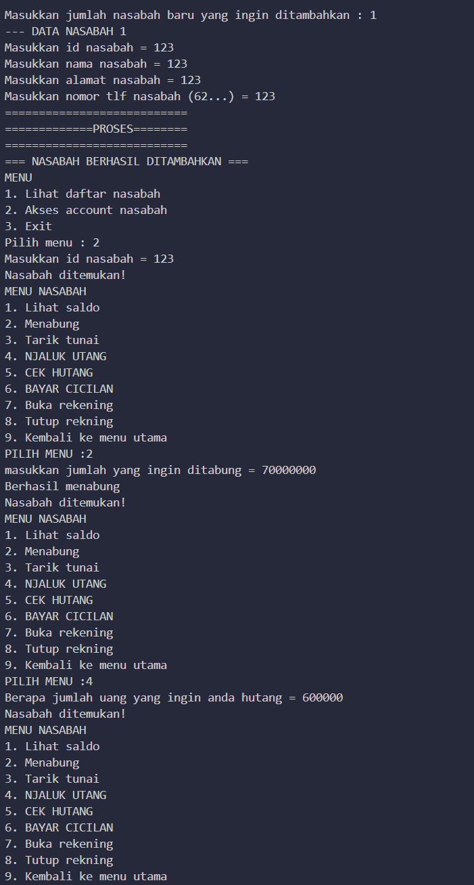

# PERTEMUAN 2

## NAMA : Taufiq Satriaji APR
## KELAS : SIB2C
## NIM : 2241760142
<h1> OUTPUT </h1>

1.	Sebutkan 2 karakteristik class/objek! 
Enkapsulasi adalah konsep yang memungkinkan data (variabel) dan metode (fungsi) yang terkait dengan suatu objek
Inheritance adalah konsep yang memungkinkan Anda untuk membuat kelas baru (subclass atau derived class) berdasarkan kelas yang sudah ada

2.	Kata kunci apakah yang digunakan untuk mendeklarasikan class? 
Class

3.	Perhatikan class Film yang ada di Praktikum di atas, ada berapa atribut yang dimiliki oleh class tersebut? Sebutkan! Dan pada baris berapa saja deklarasi atribut dilakukan? 
Judul, Genre, Rate, jumlahTiket, hargaTiket; (3 dan 4)

4.	Ada berapa method yang dimiliki oleh class tersebut? Sebutkan! 
 (tampilFilm, tambahTiket, kurangiTiket, total revenue)

5.	Perhatikan method kurangiTiket() yang ada di class Film, modifikasi isi method tersebut sehingga proses pengurangan hanya dilakukan jika stok masih ada (masih lebih besar dari 0) 
void kurangiTiket(int n){
        if (jumlah <= jumlahTiket) {
            jumlahTiket -= jumlah;
        } else {
            System.out.println("Tidak dapat mengurangi tiket lebih dari jumlah yang tersedia.");
        }
    }Menurut Anda, mengapa method tambahTiket() dibuat dengan memiliki 1 parameter berupa bilangan int? 
Penggunaan parameter berupa bilangan integer (int) dalam method tambahTiket() dalam sebuah class seperti Film mungkin dibuat dengan tujuan untuk memberikan fleksibilitas dalam menambahkan tiket ke stok film tertentu.

6.	Menurut Anda, mengapa method totalRevenue() memiliki tipe data int? 
Pemilihan tipe data int untuk method totalRevenue() akan sangat tergantung pada bagaimana data pendapatan direpresentasikan dalam konteks program yang lebih besar.

7.	Menurut Anda, mengapa method tambahTiket() memiliki tipe data void? 
untuk melakukan penambahan tiket ke dalam suatu objek atau struktur data tertentu, bukan untuk mengembalikan nilai. 

1.	Pada class FilmMain, pada kode apa yang digunakan untuk proses instansiasi? Apa nama objek yang dihasilkan? 
  Film film1 = new Film(); objek yang dihasilkan adalah film 1
2.	Bagaimana cara mengakses atribut dan method dari suatu objek?  menggunakan syntax dot(.) diikuti nama atribut atau method yang ingin diakses

1.	Berdasarkan uji coba 3.2, apakah class yang akan dibuat array of object harus selalu memiliki atribut dan sekaligus method?Jelaskan! 
Tidak, class yang akan dibuat sebagai array of object tidak harus memiliki atribut dan metode. Sebenarnya, kelas tersebut dapat memiliki hanya atribut, hanya metode, atau bahkan tidak memiliki keduanya. Keharusan untuk memiliki atribut dan metode pada kelas tergantung sepenuhnya pada kebutuhan dan desain program yang 

2.	Apakah class PersegiPanjang memiliki konstruktor?Jika tidak, kenapa dilakukan pemanggilan konstruktur pada baris program berikut : TIDAK Java sebenarnya akan memanggil konstruktor default yang dibuat otomatis untuk PersegiPanjang. Dalam hal ini, karena Anda tidak mendefinisikan konstruktor khusus, Java akan menggunakan konstruktor default yang tidak melakukan apa-apa selain menginisialisasi objek.

Apa yang dimaksud dengan kode berikut ini:
ppArray[0]: Ini adalah deklarasi sebuah elemen dalam array ppArray dengan indeks 0. Dalam hal ini, kita memilih elemen pertama dalam array.
new PersegiPanjang(): Ini adalah cara untuk membuat objek baru dari kelas PersegiPanjang. new digunakan untuk mengalokasikan memori untuk objek baru, dan PersegiPanjang() adalah pemanggilan konstruktor default (tanpa parameter) untuk kelas PersegiPanjang. Dengan demikian, objek PersegiPanjang akan dibuat, tetapi atributnya tidak akan diinisialisasi dengan nilai apa pun.

Apa yang dimaksud dengan kode berikut ini:
PersegiPanjang[]: Ini adalah tipe data array yang mengindikasikan bahwa ppArray adalah sebuah array yang akan berisi objek-objek dari tipe PersegiPanjang. Ini berarti ppArray akan menyimpan beberapa objek dari kelas PersegiPanjang.
ppArray: Ini adalah nama variabel yang Anda berikan pada array tersebut.
= new PersegiPanjang[3];: Ini adalah bagian yang melakukan inisialisasi array. Dalam hal ini, Anda membuat array ppArray yang terdiri dari 3 elemen. Setiap elemen dari array ini akan berisi objek dari kelas PersegiPanjang. Namun, saat inisialisasi, elemen-elemen tersebut belum memiliki objek sebenarnya, hanya sudah dialokasikan memori untuk mereka.

1.	Apakah array of object dapat diimplementasikan pada array 2 Dimensi?
Ya, array of object dapat diimplementasikan pada array 2 Dimensi.

2.	Jika jawaban soal no satu iya, berikan contohnya! Jika tidak, jelaskan! 
Pada contoh di atas, kita membuat class Mahasiswa dengan atribut nama dan umur. Kemudian, kita menggunakan array of object Mahasiswa[][] dengan ukuran 2x2 dan menginisialisasi setiap elemennya dengan objek Mahasiswa yang berbeda. Selanjutnya, kita dapat mengakses dan mencetak data Mahasiswa menggunakan nested loop untuk mengiterasi semua elemen pada array 2 Dimensi.

3.	Jika diketahui terdapat class Persegi yang memiliki atribut sisi bertipe integer, maka kode dibawah ini akan memunculkan error saat dijalankan. Mengapa? 
Deklarasi array ppArray salah. Tanda kurung siku [] harus ditempatkan setelah tipe data Persegi, bukan setelah 100. Deklarasi yang benar adalah: Persegi[] ppArray = new Persegi[100];
Setelah deklarasi diperbaiki, array ppArray akan dibuat dengan ukuran 100, tetapi semua elemen akan diinisialisasi sebagai null karena objek bertipe Persegi belum ditetapkan ke array.

4.	Modifikasi kode program pada praktikum 3.3 agar length array menjadi inputan dengan Scanner! 
System.out.println("Masukkan panjang array: ");
        int length = sc.nextInt();

        PersegiPanjang[] ppArray = new PersegiPanjang[length];

5.	Apakah boleh Jika terjadi duplikasi instansiasi array of objek, misalkan saja instansiasi dilakukan 
pada ppArray[i] sekaligus ppArray[0]?Jelaskan ! 

        Dalam bahasa pemrograman Java, Anda tidak dapat melakukan duplikasi instansiasi objek di dalam array dengan cara yang sama. Ketika Anda melakukan ppArray[i] = new PersegiPanjang();, itu akan membuat objek PersegiPanjang baru dan menempatkannya di elemen i dalam array. Jika Anda mencoba melakukan hal yang sama untuk elemen lain dengan ppArray[0], maka objek yang sebelumnya ada di elemen 0 akan digantikan dengan objek yang baru, sehingga objek yang sebelumnya akan hilang dari array.

        

1.	Dapatkah konstruktor berjumlah lebih dalam satu kelas? Jelaskan dengan contoh! 
        Ya, dalam sebuah kelas, Anda dapat memiliki lebih dari satu konstruktor. Ini dikenal sebagai overloading konstruktor.

