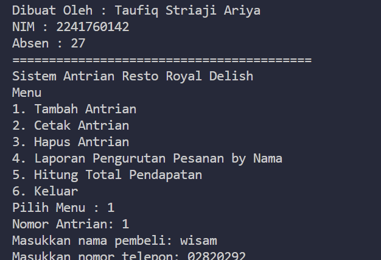
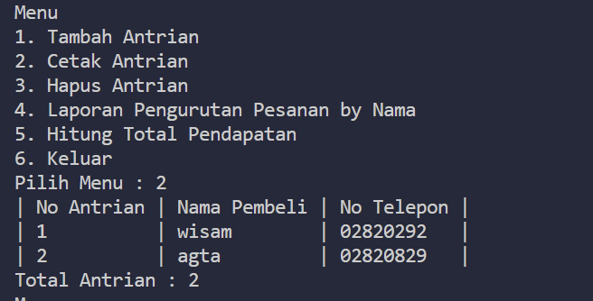
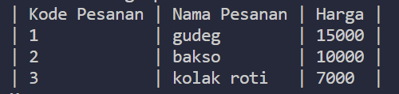
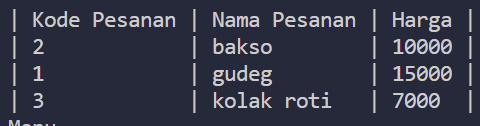
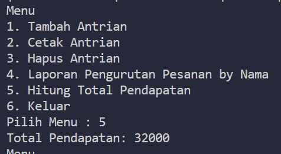

# Laporan UTS

## 1. Tambah Antrian

## 2. Cetak Antrian

## 3. Hapus Antrian

### Penjelasan

untuk penghapusan antrian menginput nama makanan serta harga, agar antrian itu selesai, setelah selesai maka lanjut antrian berikutnya.

## 4. Laporan pengurutan by nama

Sebelum di urutkan

Sesudah diurutkan

## 5. Total Pendapatan

# Link Youtube

https://youtu.be/Tn2WJvUbqas?si=eC6YGDB0DeRnMP8v
